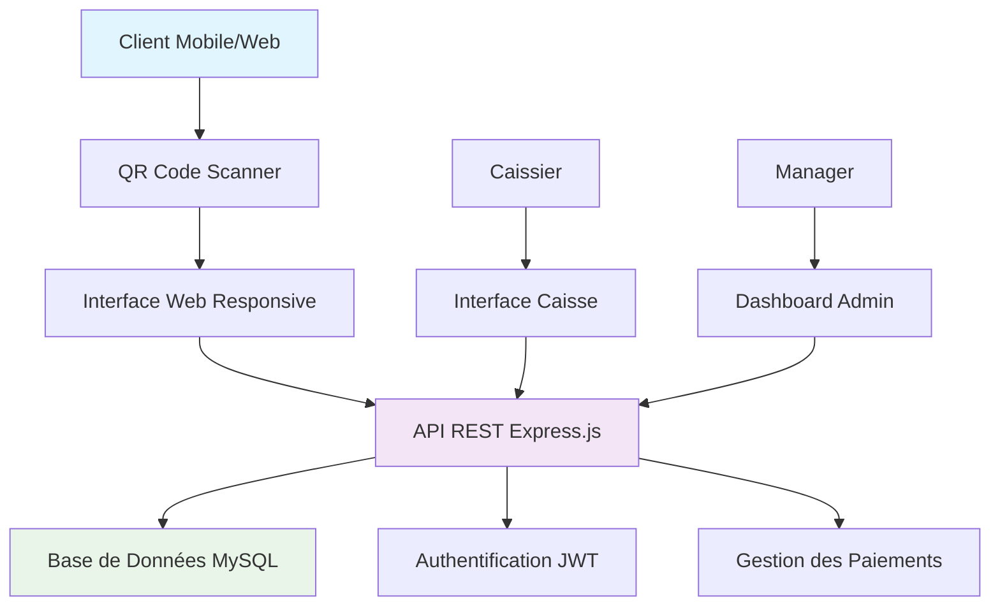

# 🍽️ Restauration Interactive - Backend API

<div align="center">


**Une API moderne pour restaurants avec commande via QR Code**

[🚀 Démarrage rapide](#-démarrage-rapide) • [📖 Documentation](#-documentation) • [🔧 Installation](#-installation) • [🧪 Tests](#-tests)

</div>

---

## 🌟 Aperçu du Projet

**Restauration Interactive** est une solution complète qui permet aux clients de commander directement depuis leur table via un QR Code, sans intervention du personnel. L'API backend gère les commandes, paiements, et la gestion des tables en temps réel.

### ✨ Fonctionnalités Principales

- 🎯 **Commande via QR Code** - Interface web responsive accessible par QR Code
- 💳 **Paiements Multiples** - Espèces, Mobile Money, Carte, À la caisse
- 📱 **Interface Moderne** - Compatible smartphones, tablettes, PC
- 🔐 **Sécurité Avancée** - Authentification JWT, validation des données
- 📊 **Gestion Temps Réel** - Suivi des commandes et paiements
- 🍽️ **Menu Dynamique** - Gestion des produits et stocks
- 👥 **Multi-utilisateurs** - Clients, Caissiers, Managers

---

## 🏗️ Architecture



---

## 🚀 Démarrage Rapide

### Prérequis

- **Node.js** 18+ 
- **MySQL** 8.0+
- **npm** ou **yarn**

### Installation Express

```bash
# Cloner le projet
git clone https://github.com/votre-username/restauration-interactive-backend.git
cd restauration-interactive-backend

# Installer les dépendances
npm install

# Configurer l'environnement
cp .env.example .env
# Éditer .env avec vos paramètres

# Initialiser la base de données
mysql -u root -p < database/init.sql

# Installer les données gabonaises
mysql -u root -p restauration < database/install-gabon-data.sql

# Démarrer le serveur
npm run dev
```

### 🌍 Variables d'Environnement

```env
# Base de données
DB_HOST=localhost
DB_USER=root
DB_PASSWORD=votre_mot_de_passe
DB_NAME=restauration
DB_PORT=3306

# Serveur
PORT=3000
NODE_ENV=development

# Sécurité
JWT_SECRET=M@thematique2003
CORS_ORIGINS=http://localhost:3000,http://localhost:3001

# QR Codes
QR_CODE_BASE_URL=http://localhost:3000/table
```

---

## 📖 Documentation

### 🔗 Endpoints Principaux

| Méthode | Endpoint | Description |
|---------|----------|-------------|
| `GET` | `/` | Informations API |
| `GET` | `/health` | État du serveur |
| `GET` | `/table/:qrCode` | Page table (QR Code) |
| `GET` | `/api/client/menu` | Menu des produits |
| `POST` | `/api/client/table/:qrCode/session` | Créer session client |
| `POST` | `/api/client/session/:id/commande` | Passer commande |
| `POST` | `/api/client/commande/:id/paiement` | Effectuer paiement |

### 🎯 Exemples d'Utilisation

#### Scanner un QR Code
```bash
curl http://localhost:3000/table/TBL001LIBREVILLE123456789
```

#### Créer une session client
```bash
curl -X POST http://localhost:3000/api/client/table/TBL001LIBREVILLE123456789/session \
  -H "Content-Type: application/json" \
  -d '{"nomComplet": "MBOUMBA Jean-Baptiste"}'
```

#### Récupérer le menu
```bash
curl http://localhost:3000/api/client/menu
```

---

## 🧪 Tests

### Tests Automatiques

```bash
# Lancer les tests
npm test

# Test de l'API
node test-server.js

# Test de validation
node test-validation.js
```

### Tests Postman

1. **Importer la collection** : `postman-collection.json`
2. **Configurer l'environnement** : `http://localhost:3000`
3. **Exécuter les tests** dans l'ordre recommandé

### 🎯 Ordre de Test Recommandé

1. ✅ **État du serveur** - `GET /health`
2. ✅ **Informations API** - `GET /`
3. ✅ **Menu des produits** - `GET /api/client/menu`
4. ✅ **QR Code table** - `GET /table/TBL001LIBREVILLE123456789`
5. ✅ **Création session** - `POST /api/client/table/:qrCode/session`
6. ✅ **Passer commande** - `POST /api/client/session/:id/commande`
7. ✅ **Effectuer paiement** - `POST /api/client/commande/:id/paiement`

---

## 🍽️ Données Gabonaises

Le projet inclut des données typiques du Gabon :

### 🏷️ Tables du Restaurant
- **Table 1** (Libreville) - 4 places
- **Table 2** (Port-Gentil) - 6 places  
- **Table 3** (Franceville) - 2 places
- **Table 4** (Oyem) - 4 places
- **Table 5** (Moanda) - 8 places

### 🍛 Plats Typiques
- **Poulet Nyembwe** - 2500 FCFA
- **Poisson Braisé** - 3000 FCFA
- **Saka-Saka** - 1500 FCFA
- **Plantain Frit** - 1000 FCFA
- **Jus de Bissap** - 500 FCFA

### 👥 Clients Gabonais
- **MBOUMBA Jean-Baptiste**
- **NDONG Mireille**
- **BIGNA Jean-Paul**
- **MAGANGA Marie-Claire**

---

## 🔧 Installation

### Installation Manuelle

1. **Base de données** :
   ```sql
   -- Créer la base
   CREATE DATABASE restauration CHARACTER SET utf8mb4 COLLATE utf8mb4_unicode_ci;
   
   -- Importer le schéma
   mysql -u root -p restauration < database/init.sql
   ```

2. **Données gabonaises** :
   ```sql
   -- Importer les données
   mysql -u root -p restauration < database/gabon-data.sql
   mysql -u root -p restauration < database/gabon-specialties.sql
   mysql -u root -p restauration < database/gabon-promotions.sql
   ```

3. **Vérification** :
   ```sql
   -- Vérifier les données
   mysql -u root -p restauration < database/verification-rapide.sql
   ```

### Installation Automatique

```bash
# Windows
install-gabon-data.bat

# Linux/Mac
chmod +x install-gabon-data.sh
./install-gabon-data.sh
```

---

## 📊 Structure du Projet

```
restauration-interactive-backend/
├── 📁 config/                 # Configuration
│   ├── config.js             # Configuration principale
│   └── database.js           # Connexion MySQL
├── 📁 controllers/            # Logique métier
│   ├── clientController.js   # Contrôleur clients
│   ├── caisseController.js   # Contrôleur caisse
│   └── managerController.js  # Contrôleur manager
├── 📁 middleware/             # Middlewares
│   ├── auth.js              # Authentification
│   ├── validation.js        # Validation des données
│   └── security.js          # Sécurité
├── 📁 models/                # Modèles de données
│   ├── Client.js            # Modèle client
│   ├── Table.js             # Modèle table
│   └── Produit.js           # Modèle produit
├── 📁 routes/                # Routes API
│   ├── clientRoutes.js      # Routes clients
│   ├── caisseRoutes.js      # Routes caisse
│   └── qrRoutes.js          # Routes QR codes
├── 📁 database/              # Scripts base de données
│   ├── init.sql             # Schéma initial
│   ├── gabon-data.sql       # Données gabonaises
│   └── verification-rapide.sql
├── 📄 server.js              # Point d'entrée
├── 📄 package.json           # Dépendances
└── 📄 README.md              # Documentation
```

---

## 🛡️ Sécurité

- **Helmet.js** - Sécurisation des headers HTTP
- **Rate Limiting** - Protection contre les attaques
- **JWT** - Authentification sécurisée
- **Validation** - Sanitisation des données
- **CORS** - Gestion des origines croisées

---

## 🚀 Déploiement

### Production

```bash
# Variables d'environnement
NODE_ENV=production
PORT=3000
DB_HOST=your-db-host
DB_USER=your-db-user
DB_PASSWORD=your-db-password

# Démarrer
npm start
```

### Docker

```dockerfile
FROM node:18-alpine
WORKDIR /app
COPY package*.json ./
RUN npm ci --only=production
COPY . .
EXPOSE 3000
CMD ["npm", "start"]
```

---

## 🤝 Contribution

1. **Fork** le projet
2. **Créer** une branche (`git checkout -b feature/nouvelle-fonctionnalite`)
3. **Commit** vos changements (`git commit -m 'Ajouter nouvelle fonctionnalité'`)
4. **Push** vers la branche (`git push origin feature/nouvelle-fonctionnalite`)
5. **Ouvrir** une Pull Request

---

## 📝 Changelog

### v1.0.0 (2024-09-18)
- ✨ Version initiale
- 🎯 API complète pour restauration interactive
- 🍽️ Données gabonaises intégrées
- 🔐 Système de sécurité avancé
- 📱 Interface responsive

---

## 📄 Licence

Ce projet est sous licence MIT. Voir le fichier [LICENSE](LICENSE) pour plus de détails.

---

## 👨‍💻 Auteur

**Votre Nom**
- GitHub: [@votre-username](https://github.com/votre-username)
- Email: votre.email@example.com

---

## 🙏 Remerciements

- **Express.js** - Framework web
- **MySQL** - Base de données
- **JWT** - Authentification
- **Communauté Node.js** - Support et documentation

---

<div align="center">

**⭐ Si ce projet vous aide, n'hésitez pas à lui donner une étoile !**

[🔝 Retour en haut](#-restauration-interactive---backend-api)

# Restaurant_fullstack

